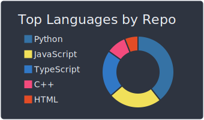

# Hi there :wave:

- 🔭 I’m Appaji, Computer Science Student at IIT Patna

**I like to code in the following way.**

> Readability is the most important aspect of your code. Even more so than correctness. If it's readable, it's easy to fix. It's also easy to optimize, easy to change, easy to understand. And hopefully other developers can learn something from it too. [_Reference_](https://stackoverflow.com/a/407351/12347371)

> Write small methods. It seems that programmers love to write loooong methods where they do multiple different things. I think that a method should be created wherever you can name one. [_Reference_](https://stackoverflow.com/a/406805/12347371)

## My Recent Gists

- [Continuous Comparison for C++](https://gist.github.com/CITIZENDOT/8a44af09fa63de675a15af9b152366a0)
- [Binary Search Tree with Smart Pointers](https://gist.github.com/CITIZENDOT/db5a5b9215bafc58e553fbbc730710d2)

## Stats

 
